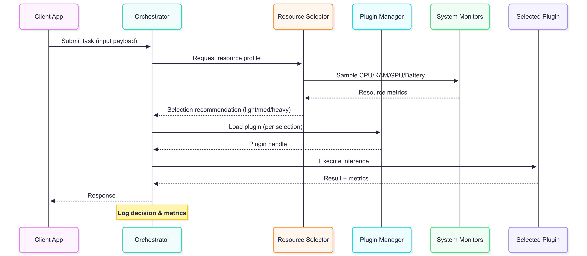
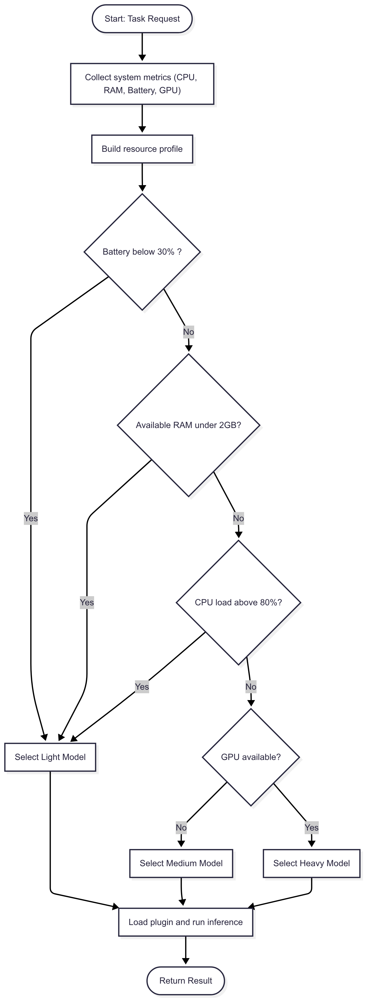

# Lightweight AI Plugin Framework

A modular, resource-aware AI runtime designed to run lightweight models efficiently on edge devices. This framework dynamically selects and loads the most suitable AI plugin based on system resource availability such as CPU, memory, and battery level.

## 💡 Purpose

This project aims to enable intelligent, energy-efficient AI deployment through an abstract plugin-based system that adapts at runtime. It’s built for flexibility, cross-platform compatibility, and integration with various AI backends.

## 🧠 Core Concepts

- **Plugin-Based AI**: Each AI function is encapsulated as a plugin with multiple model variants (e.g., light, medium, heavy).
- **Resource-Aware Switching**: Automatically selects the optimal plugin based on real-time system stats.
- **Modular & Abstract**: Clean interfaces and separation of concerns to support scalability and testing.
- **Cross-Platform**: Designed to support Linux, Windows, and Android-based edge systems.

## 🏗️ Architecture Overview

- **Core Layer**: Orchestrates plugin management, resource monitoring, and decision logic.
- **Plugin Layer**: Individual AI models implementing a shared interface (e.g., object detection with varying complexity).
- **System Layer**: Platform-specific modules to monitor system performance and power metrics.
- **Interfaces**: Abstract base classes defining contracts for plugins and monitors.

## 🧰 Initial Tech Stack

- **Language**: Python (initial), with future support for C++ for embedded targets
- **AI Runtimes**: ONNX Runtime, TensorFlow Lite, PyTorch (optional)
- **Monitoring**: `psutil`, `/proc` (Linux), platform APIs (Windows, Android)
- **Plugin Handling**: `importlib`, dynamic loading, hot-swapping
- **Packaging**: `setuptools`, Docker (optional)

## Architecture — Sequence View

   

## Routing Flowchart

Below is the decision process the orchestrator uses to pick the best model
based on system resources and defined thresholds.

**Thresholds (v1):**
- Battery below 30% → Light Model
- RAM under 2 GB → Light Model
- CPU load above 80% → Light Model
- GPU available + sufficient resources → Heavy Model, otherwise Medium Model

## 📄 License

MIT License

## 🤝 Contributions

Open to contributions, ideas, or collaborations—especially on model optimization, multi-platform support, and performance tuning.

