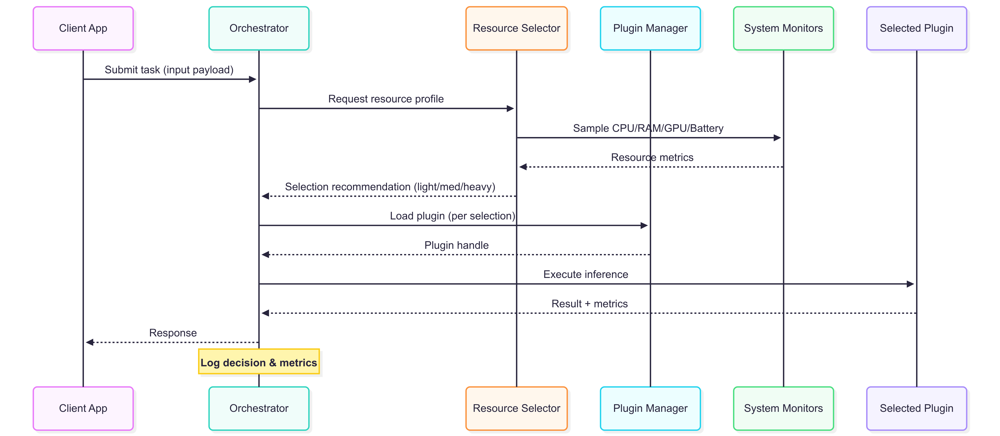
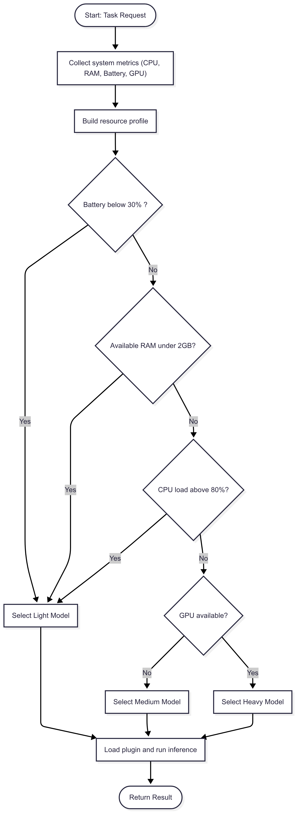

<div align="center">

# Lightweight AI Plugin Framework

> **Resource-aware AI runtime for edge devices**

[]()
[]()
[]()
[]()

</div>

A modular, resource-aware AI runtime that dynamically selects the optimal model for your device based on real-time CPU, memory, and battery levels.

---

## 🎯 Why?

Edge devices have **limited and fluctuating resources**. This framework solves that by:

- **Auto-switching** between light / medium / heavy models based on system load
- **Hot-swapping** plugins at runtime without restart
- **Cross-platform** — Linux, Windows, Android

---

## 🚀 Quick Start

```bash
pip install -r requirements.txt
python main.py
```

That's it. The orchestrator monitors your system and selects the right model automatically.

---

## 🏗️ Architecture




```
Core Layer     → Plugin management, decision logic
Plugin Layer   → Individual AI models (light/medium/heavy)
System Layer   → Platform-specific resource monitoring
Interfaces     → Abstract contracts for plugins & monitors
```

### Decision Logic

| Condition | Selected Model |
|-----------|---------------|
| Battery < 30% | Light |
| RAM < 2 GB | Light |
| CPU load > 80% | Light |
| GPU available + sufficient resources | Heavy |
| Otherwise | Medium |

---

## 🛠️ Tech Stack

**Python** — ONNX Runtime · TensorFlow Lite · PyTorch  
**System** — `psutil`, platform APIs, `/proc`  
**Packaging** — setuptools, Docker

---

## 📁 Project Structure

```
├── core/          # Orchestrator & plugin management
├── plugins/       # AI model plugins (light/medium/heavy)
├── models/        # Model definitions & interfaces
├── interfaces/    # Abstract base classes
├── system/        # Resource monitoring
├── utils/         # Helpers
├── main.py        # Entry point
├── Images/        # Architecture diagrams
└── requirements.txt
```

---

## 📜 License

MIT — open for collaboration. PRs welcome, especially on model optimization and multi-platform support.
